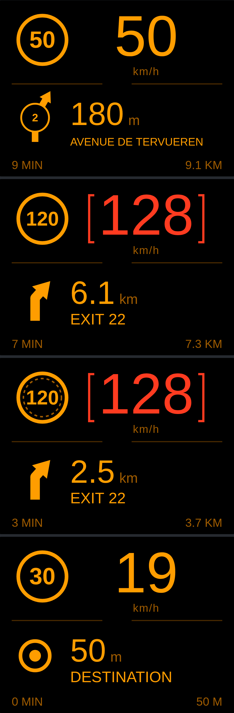

# NavHUD

A turn-by-turn navigation head-up display, styled after the BMW E60's.

An Android head unit (or phone) does the routing, the position tracking and the
spoken guidance, and pushes speed limit, turn arrow, distance and ETA down a USB
cable to an Arduino-class board driving a TFT.

```
   Android head unit                               ESP32 / Arduino
  ┌────────────────────────┐                      ┌──────────────────┐
  │ GPS @ 1 Hz             │                      │  NMEA-style      │
  │ Mapbox Directions      │   USB serial         │  parser          │
  │   + maxspeed           │ ───────────────────► │        ↓         │
  │ RouteTracker           │   $HUD,...*CS        │  ILI9341 TFT     │
  │   projection, limits   │   115200 8N1, 4 Hz   │  320×240         │
  │ Map · search · voice   │                      │  E60 amber theme │
  └────────────────────────┘                      └──────────────────┘
```



Top to bottom: approaching a roundabout with the exit number, cruising the
motorway 8 over the limit (BMW's bracket treatment on the number), a stretch
where the map has no speed-limit data — the dashed inner ring means "this is the
last limit I knew about" — and arrival.

A full-colour theme is included too; one `#define` switches between them.

Open `tools/layout_preview.html` in a browser to play the whole drive, flip
themes, and tune the layout before you flash anything.

See [CHANGELOG.md](CHANGELOG.md) for what changed in 1.8.1, and
[docs/FEATURES.md](docs/FEATURES.md) for the full list of what it does.
[docs/WAZE.md](docs/WAZE.md) compares it feature by feature with Waze — what it
matches, what it does not, and why.
For what screen to buy and why, see [docs/SCREEN.md](docs/SCREEN.md).

## What's here

```
android/            Android Studio project (Kotlin, no Play Services needed)
  …/MapActivity.kt  the driving screen: map, route, speed, next turn
  …/SearchActivity  destination search with local recents
  …/VoiceGuide.kt   spoken guidance, speed-scaled thresholds
  …/nav/            NavProvider interface + Mapbox implementation
  …/nav/Lanes.kt    lane guidance: three states, every exit combination
  …/nav/RoadSigns.kt  which colour a direction sign is, country by country
  …/ui/JunctionView   the carriageway in perspective, with the slip road
  …/ui/SpeedGauge     speed and limit as one dial
  …/alerts/Zones.kt   low-emission zones from OpenStreetMap
  …/alerts/RoadAhead  level crossings, speed bumps, toll booths
  …/link/           USB serial and Bluetooth transports
  …/Geo.kt          polyline decode, projection onto the route
  …/RouteTracker.kt the actual navigation engine
arduino/NavHud/     the sketch: protocol parser + two pluggable themes
  theme_e60.h       BMW E60: monochrome amber
arduino/test/       host-compiled tests, incl. a stub TFT that checks layout
arduino/config/     TFT_eSPI User_Setup.h for this wiring
tools/hud_sim.py          replays a synthetic drive into the board from a PC
tools/layout_preview.html  the display in a browser, for tuning the layout
tools/geo_reference.py     Python port of Geo.kt, verifies the geometry
tools/tracker_reference.py Python port of RouteTracker.kt, verifies the logic
tools/voice_reference.py   Python port of VoiceGuide.kt, prints the transcript
apk/                a signed, installable build — see apk/README.md
docs/BUILD.md       parts, wiring, power, head units, mounting
docs/PROVIDERS.md   why Mapbox, and how to swap in HERE / TomTom / Valhalla
docs/WAZE.md        feature-by-feature comparison with Waze
PROTOCOL.md         the wire format
```

## Install the app

A signed APK is in [`apk/NavHUD-1.0.apk`](apk/) — Android 7.0 or newer. Copy it
across, open it with a file manager, allow the install. Then paste a free Mapbox
token on the Setup screen (the token is entered in the app, not baked into the
build, so this APK works for anyone). Full notes in [apk/README.md](apk/README.md).

## Getting it running

The order that wastes the least time:

1. **Flash the sketch, test it from your PC.** `python3 tools/hud_sim.py --port
   /dev/ttyUSB0` replays a four-minute drive that exercises every screen element.
   No phone, no API key, no car.
2. **Build the app, press Go → Demo drive.** Same synthetic drive, now over the
   real USB link, with voice. Proves the cable, the permissions and the encoder.
3. **Add a Mapbox token, search a destination.** Now it's real.

**On a head unit this is easier than on a phone**, not harder: a head unit is
permanently powered and its USB ports are already host ports, so the whole
"phone can't charge while acting as USB host" problem simply doesn't exist.

Full instructions in [docs/BUILD.md](docs/BUILD.md).

## Design notes

**Why a text protocol.** `$HUD,72,50,2,0,180,845,7300,5,RUE DE LA LOI*62` — you
can read it in a serial monitor, type it by hand to test a screen state, and
grep it out of a log. The XOR checksum is NMEA's, so any GPS tool already knows
how to validate it. Binary would save maybe 40 bytes per frame at 115200 baud,
which buys nothing and costs every debugging session you'll ever have.

**Why the head unit is the brain.** It has a data connection, it's powered by
the car, and it's already bolted to the dashboard. The ESP32's job is to be a
display that never crashes and never lies — if frames stop arriving for three
seconds it blanks to `NO LINK` rather than showing a stale speed limit, which is
the one failure mode that would actually be dangerous.

**Why voice thresholds scale with speed.** "In 300 metres, turn right" is
useless at 120 km/h — that's nine seconds' warning. The announcement distances
are picked per speed band so every call lands roughly the same number of seconds
before the turn. `tools/voice_reference.py --transcript` prints exactly what
you'd hear on the demo drive; it's 21 announcements over 10 km.

**Why the tracking code is the interesting part.** See
[docs/PROVIDERS.md](docs/PROVIDERS.md) — for a HUD, map data quality is rarely
the weak link. Snapping to the wrong road is. The projection does segment-wise
matching with a forward search window and a heading penalty, which is what keeps
you on the right carriageway of a divided highway.

**Why the car marker is drawn on the route, not at the GPS fix.** A good urban
fix is 5–10 m out; a bad one is 30. Draw the marker where the fix says and it
spends half of Brussels parked in the buildings, which reads as "this app is
broken" even when the navigation underneath it is perfect. So the marker is
drawn at the projection of the fix onto the route polyline and pointed along the
road there — the same operation Google sells as the Roads API. It moves *along
the route* between fixes rather than across open ground, and it stops being
pinned the moment you are genuinely more than 25 m off the line, because past
that point the route is no longer where you are.

**Why there is a gyroscope in a GPS app.** A GPS bearing is derived from the
movement between two fixes, arrives once a second, and is meaningless below
walking pace. On its own it means the marker turns most of a second after the
steering wheel does. A gyroscope covers exactly that missing second: integrate
it for the fast part of the motion, let GPS correct the slow drift, and the map
turns with the car. The phone's own gyroscope is used by default; if the HUD has
an MPU-6050 fitted it reports its yaw rate up the cable and that wins, because a
sensor bolted to the car beats one in a cradle that gets knocked. Both are
optional — without either, it degrades to plain GPS heading.

**Why the French numbers are spelled out.** Set the voice to French and ask it
to say "90" and you get *quatre-vingt-dix*, in Brussels, where the number is
*nonante*. No Android setting changes that: the engine applies metropolitan
French numeral rules to digits whatever locale you request. The only fix is to
stop handing it digits — `FrenchNumbers` writes them out, and *nonante* is just
a word that any French voice reads correctly. Belgium keeps *quatre-vingts* for
80; *huitante* is Swiss.

## Tests

```bash
cd arduino/test && make check
```

Nine stages, all green:

1. **Protocol** — checksums, truncated frames, resync, field-count errors,
   buffer overflow, out-of-range clamping.
2. **Geometry** — the polyline decoder against the canonical Google test vector,
   haversine against known distances, projection accuracy, and the
   divided-highway case where heading decides which carriageway you're on.
3. **Navigation logic** — a simulated drive asserting every maneuver is announced
   in order, the countdown never ticks upwards, limits track the sections being
   driven, the data-gap hold-over fires and clears, arrival is flagged only at
   the end, and an 80 m detour is caught with no false positives before it.
4. **Voice** — every maneuver announced, never more than three times, stages
   never repeat or go backwards, the final call always lands within 200 m, and
   no two announcements stack up on top of each other.
5–6. **Both themes' layout** — the sketch's themes compiled against a stub TFT
   that records every primitive: 27 states each, nothing drawn off-panel, and no
   two screen zones ever writing the same pixel. That's the check that catches
   an arrow crossing into the distance digits before your dashboard does.
7–8. **The sketch itself** — compiled on the host and run against a scripted
   serial stream: link up, deltas, an unchanged frame repainting nothing, link
   lost, link restored, a corrupt frame ignored, 400 frames stay on-panel.
9. **End to end** — 1,942 + 1,853 generated frames through the exact parser the
   sketch compiles, zero rejected.

And on the Android side, **249 JVM unit tests against the real Kotlin** (not the
Python ports):

```bash
cd android && ./gradlew testReleaseUnitTest
```

These cover the same ground as stages 2–4 but on the shipping code, plus the
things that only exist on the phone: the polyline decoder against Google's
canonical vector, the divided-highway heading case, a full simulated drive
through `RouteTracker`, the frame encoder producing byte-for-byte the checksums
the C++ parser tests assert, every Mapbox maneuver mapping, the address parser
against the exact Belgian address that used to return nothing, the GPS fix
filter refusing a cell-tower fix while GPS is live, the gyroscope filter turning
90° in three seconds and not drifting when the car is parked, the marker staying
on the road under 18 m of simulated GPS error, the reroute timing, every French
numeral from 0 to 3000, lane guidance in all three states including the
reconstruction when the router omits `active_direction`, the eleven-lane window
that must not drop the exit lane, the sign colour of every European country
including Belgium's inverted rule, point-in-polygon against a low-emission zone,
and the reach of a level-crossing warning at 30 and at 120 km/h.

What is still unverified: the Android UI itself. There's no KVM in the build
environment, so no emulator ran — `MapActivity`, `SearchActivity` and the USB
permission flow are compile-checked and lint-clean (zero errors), but nobody has
watched them draw. That's what the demo drive is for.

## Known limits

- Multi-waypoint routes concatenate each leg's annotations; the segment mapping
  is exact for a single destination and approximate if you add via-points.
- ETA is scaled from the route's own duration estimate rather than live traffic
  after departure. Re-routing refreshes it.
- **Temporary speed limits are the honest gap.** Live *closures* and *traffic*
  come from Mapbox's `closure` and `congestion` annotations and are drawn on the
  route line. The speed limits themselves come from OpenStreetMap, where a
  roadworks limit is only present if somebody mapped it — which for a two-week
  contraflow, they usually have not. Feeds that carry temporary limits properly
  (TomTom, HERE) are commercial products with per-request pricing; there is no
  free source, and pretending otherwise would be worse than saying so.
- Speed-camera coverage is OpenStreetMap's: good in Belgium and France, thinner
  east of Vienna. It is an assist, not a guarantee.
- No emulator ran in the build environment, so the UI is compile-checked and
  lint-clean but not screenshot-tested. The demo drive is what exercises it.
